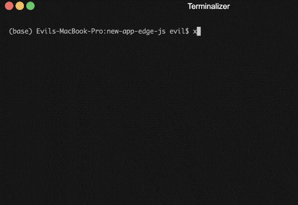

# Repl
<div style="text-align:center">

</div>

Tinker allows you to interact with your entire Xpresser application on the command line, including the current xpresser instance **`$`**. 

To enter the repl environment, run the command
```sh
xjs repl
```

This command checks for a file named `repl.js` and if not found it provides an option to automatically create the need file for you.

## repl.js
Your repl file is where the `XpresserRepl` class is called, and the node repl server is booted.

The `xjs repl` command creates these files for you.
:::: xTabs With Config File|Without Config File
::: xTab With Config File
```javascript
#!/usr/bin/env node --experimental-repl-await
const {XpresserRepl} = require('xpresser');
const repl = new XpresserRepl('/path/to/your/specified/file.js');

/**
 * Add custom context to repl
 */
// repl.addContext('customContent', 'customContent Value!');


/**
 * Start The Repl Server
 * By Booting xpresser using your config.
 */
repl.start(($) => {
    // $ (i.e xpresserInstance) is passed as the only argument.
    // repl.server is now defined.
    // Any Customization to the repl server directly can be done here.
});
```
:::
::: xTab Without Config File
```javascript
#!/usr/bin/env node --experimental-repl-await
const {XpresserRepl} = require('xpresser');
const repl = new XpresserRepl();

repl.setConfigProvider(() => {
    // return your xpresser config
    return {
        env: process.env.NODE_ENV,
        paths: {base: __dirname}
    }
})

/**
 * Add custom context to repl
 */
// repl.addContext('customContent', 'customContent Value!');


/**
 * Start The Repl Server
 * By Booting xpresser using your config.
 */
repl.start(($) => {
    // $ (i.e xpresserInstance) is passed as the only argument.
    // repl.server is now defined.
    // Any Customization to the repl server directly can be done here.
});
```
:::
::::

**Note:** Running the repl file directly e.g `node repl.js` will start the repl as expected, but you may not get to use **top level await** function.

## Setup/Configuration
Setting up a perfect **repl** for your xpresser project is easy with the `XpresserRepl` class.

### Default Context
The variables listed below are auto-loaded on boot and available in your repl session.
| Key | Description |
|-----| ----- |
| $  | current xpresser instance |

### Add Context
To add a context to your repl session
```javascript
repl.addContext(key, value);
// Or using object
repl.addContext({
    key, value,
    key1, value2
})
```

### Add files to context
`XpresserRepl` includes a helper function that can load files into your context by requiring them.
```javascript
repl.addContextFromFiles({
    User: 'backend/models/User.js',
    Mailer: 'backend/libs/Mailer.js'
})
```
Key of file path will be used as the content key.

You can also group files into one contentName
```javascript
repl.addContextFromFiles({
    User: 'backend/models/User.js',
    Mailer: 'backend/libs/Mailer.js'
}, 'models')
```


::: warning Incomplete Documentation
This documentation is not yet complete! Check back in some days time.
:::