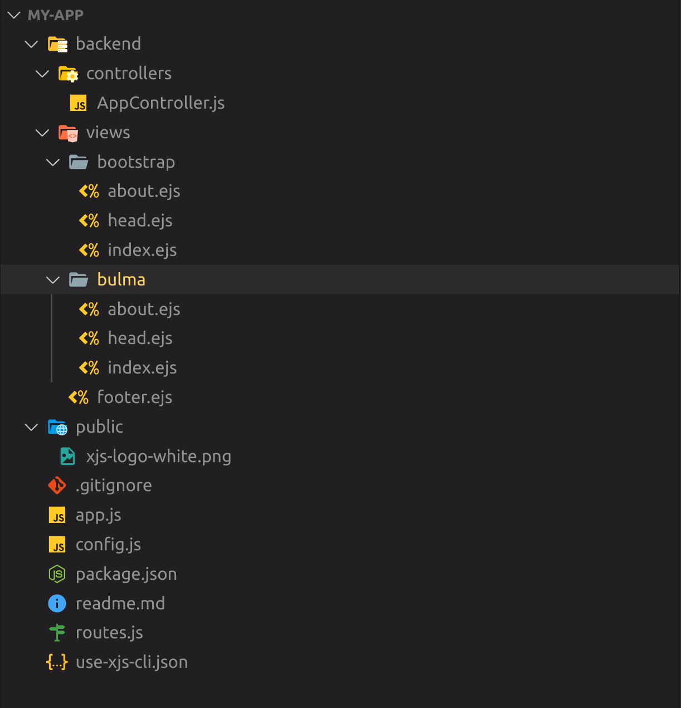

::: warning
Xpresser is still under development.
:::

# Create Your First App

### Requirement
To create your first application in few seconds you need to have [xjs-cli](./xjs-cli.md) installed.

## Steps
Open your console/terminal
```sh
xjs new
```

A prompt asking a few questions will come up.
Answer the questions and follow the prompt until you get to the end where it says you should `cd` into your `project_folder` 

A view like the image below, where `my-app` should be the name of your app.


After you run all the commands your server should start like below


Visit your server url and see your beautiful homepage waiting for you to dive in.

## Folder Structure.
Your new app structure.



Xpresser does force any folder structure, all can be configured in your `config.js` file 

In order not to mix your server side scripts with your frontend scripts xpresser provides a `backend` option in your config file.
The specified backend file is where all your server scripts will be placed. It is also the folder auto generated files by [xjs-cli](./xjs-cli.md) will be stored.

if you are not comfortable with it, lets say you want **controllers** & **views** folders to be in the base directory, change `path.backend` in your config file.

```javascript
        /**
         * Xpresser has special string paths
         * and base:// simply means xpresser should
         * use base path.
         *
         * See file: xpresser/src/config.ts
         * For all default Config options.
         */
        // BEFORE ---> backend: 'base://backend',
        backend: __dirname,
```

Then move the all content in backend to your specified folder and everything should still work perfectly.

If you take a look a the [config.js](./configuration/default.md) page you will see all the configurations available for you and how they work.


#### .... To be continued ....

