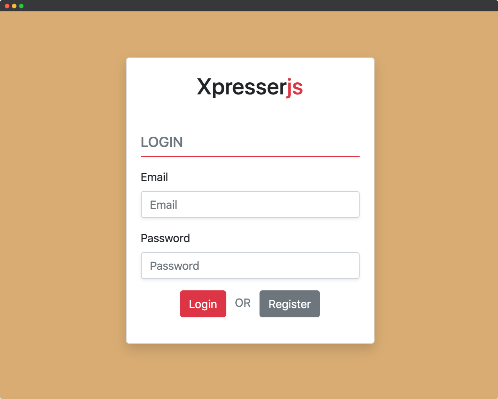
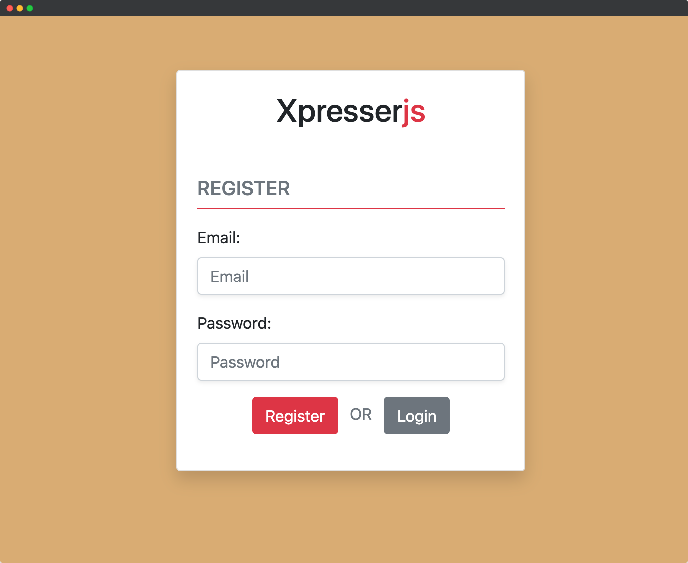

# Xpresser Auth Plugin

Xpresser in-house built auth plugin to help you get started quickly with authenticating users **(Login/Registration)**.

## What is included?
:::: xTabs Login View|Registration View
::: xTab Login View

:::

::: xTab Registration View

:::
::::

#### Extends Xpresser RequestEngine (a.k.a http): 
1. Adds `async auth()` - Loads/Refresh current logged user's data. Returns `Promise<user>`
2. Adds `authUser()` - Get cached `auth()` result, i.e `user`.
3. Adds `isLogged()` - Check if current session logged in. Returns `boolean`
    
## Installation
Add to your project using package managers
```sh
npm install @xpresser/auth
# OR
yarn add @xpresser/auth
```

Add to your `backend/plugins.json`
```json
[
    "npm://@xpresser/auth"
]
```

## Setup
Import required files into your project using the `xjs import` command.
```sh
# Import Configurations
xjs import Auth configs

# Import Models
xjs import Auth models
```
The above command will import the configuration & model files of this plugin into your `backend/configs` & `backend/models` folder respectively.


Next, Include the imported config file into your xpresser config like so:
```javascript
const authPluginConfig = require('./backend/configs/auth');

const config = {
    // .... other configs above ....
    plugins: {
        '@xpresser/auth': authPluginConfig
    }
}
```

### Session & Flash
Session and flash needs to be enabled to store logged user data and flash error messages.

Enable Session and Flash in `server.use` config.
```javascript
const config = {
    server: {
        // .... other server configs above ....
        use: {
            session: true,
            flash: true
        }
    },

    // Use default session handler
    session: {useDefault: true},
}
```

### Register Middlewares
The auth plugin includes a **global middleware** that loads the current logged in user.
You have to add it to your project.

Add to your use.json file. if you don't have one then create a use.json file in your backend folder.

:::: xTabs Javascript|Typescript
::: xTab Javascript
```json
{
  "middlewares": {
    "Auth": "npm://@xpresser/auth/Middlewares/Auth"
  },
  "globalMiddlewares": [
    "npm://@xpresser/auth/Middlewares/GlobalMiddleware"
  ]
}
```
:::
::: xTab Typescript
When using **XpresserTs** complete path to url is required else xpresser will try to load the `.ts`
```json
{
  "middlewares": {
    "Auth": "npm://@xpresser/auth/Middlewares/Auth.js"
  },
  "globalMiddlewares": [
    "npm://@xpresser/auth/Middlewares/GlobalMiddleware.js"
  ]
}
```
:::
::::

## Auth Providers
The auth providers are functions defined by you to tell the plugin how you want your login and registration handled.

- User Password Provider `[userPasswordProvider]`
- User Data Provider `[userDataProvider]`
- User Registration Handler `[userRegistrationHandler]`
- User Login Validator `[userLoginValidator]`

Located @ `backend/models/Auth/AuthProviders.js` 

### User Password Provider
This function should return the previously saved hashed password for the `primaryKey` key passed to it.

```javascript
module.exports =  {
    async userPasswordProvider(primaryKeyValue, modelPrimaryKey) {
        // Return users hashed password from database
        const user = await this.findOne({[modelPrimaryKey]: primaryKeyValue});
        if(!user) return undefined;

        // return user password.
        return user.password;
    }
}
```

if `modelPrimarykey` is `email` and the user entered the email: `john@example.com` the above code is simply running
```javascript
const user = await this.findOne({email: 'john@example.com'})
```

if the `authPasswordProvider` returns false or undefined the login is stopped, and a failed login error message displayed.

### User Data Provider
This function should return the user data of the `modelPrimaryKey`, it used by the plugin to check if a user exists and to load current logged in user data.

```javascript
module.exports = {
    async authDataProvider(email) {
        // Return users hashed password from database
        const user = await this.findOne({email});
        if(!user) return undefined;
        
        // return user data
        return user;
    }
}
```

### User Register Handler
This function is where you handle your registration using the form data passed to you.

**Note:** Must return true or any value but not `undefined, false or null`
```javascript
module.exports = {
    async userRegisterHandler(data, http) {
        // Save new user using data
        // data: {email, password: encryptedPassword}
       return await new User(data).save();
    }
}
```
The data returned is passed to the `events.userRegistered` event, given you opportunity to do more with the request `http` instance.


### User Login validator
This function is where you validate how users are allowed to login. it must return an object with this signature: 
```typescript
type Result = {error: string | false, proceed: boolean}
```
For example
```javascript
module.exports = {
    async userLoginValidator(email, http) {
        const banned = await User.count({email, banned: true});
        
        return {
            // Return error message (string) if error occurred during validation.
            error: banned? 'You have been banend' : false,

            // Return false if you don't want the plugin to respond to this request.
            proceed: true
        }
    }
}
```


### Start Your App
Navigate to `/auth` to view your login page.
